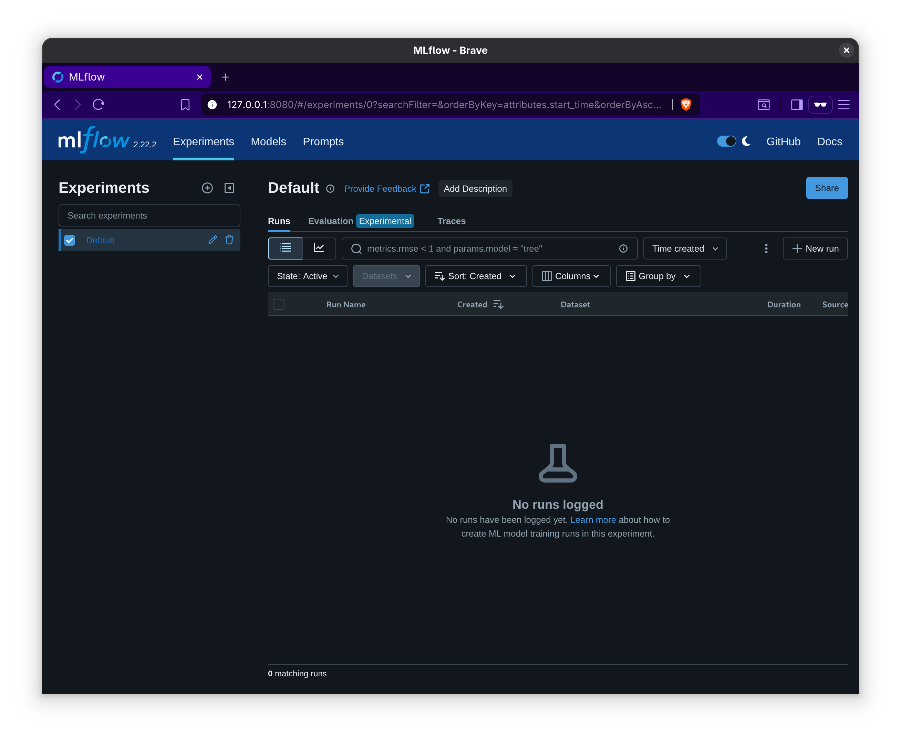

# Artifact Appendix

Paper title: Ephemeral Network-Layer Fingerprinting Defenses

Requested Badge(s):

- [x] **Available**
- [x] **Functional**
- [x] **Reproduced**

## Description

This repository contains research artifacts for **Ephemeral Network-Layer
Fingerprinting Defenses**, PETS 2026, by Tobias Pulls, Topi Korhonen, Ethan
Witwer, and Niklas Carlsson.

The code here is a snapshot to enable exact reproducibility of the defense
generation and the attack evaluation results from the paper. For up-to-date code
on creating ephemeral defenses (cleaner, bugfixes, and more features), please
see
[https://github.com/maybenot-io/maybenot](https://github.com/maybenot-io/maybenot).

The configuration files, scripts, and notes in this repository cover the entire
paper. In the [experiments/](experiments/) folder:

- [circuit-fingerprinting/](experiments/circuit-fingerprinting/) maps to Section 4, Appendix C, and Figure 6 in Section 7.
- [video-fingerprinting/](experiments/video-fingerprinting/) maps to Section 6 and the last paragraph of Appendix A.
- [wf-inf-train/](experiments/wf-inf-train/) maps to Figure 4 in Section 5.
- [wf-overview-table/](experiments/wf-overview-table/) maps to Section 5, Appendix C, and Appendix E.

In the [def-ml/](def-ml/) folder:

- [scripts/overview.sh](def-ml/scripts/overview.sh) is used to generate the data for Tables 1 and 3.
- [scripts/overview_inftrain.sh](def-ml/scripts/overview_inftrain.sh) is ued to generate the data for Table 2.
- [scripts/cross_attack_defense_heatmap.py](def-ml/scripts/cross_attack_defense_heatmap.py) generates Figures 5, 7, 8, 9, and 10.
- [scripts/defense_cost.py](def-ml/scripts/defense_cost.py) generates Figure 4.

We provide exact details on how to use these resources below.

### Security/Privacy Issues and Ethical Concerns

There are no security or privacy risks, nor any ethical concerns, associated
with this artifact.

## Basic Requirements

### Hardware Requirements

Minimal hardware requirements:

- A modern CPU or an older with more cores (convenience).
- 8 GiB of RAM.
- 200 GiB of disk (500 GiB for full Video Fingerprinting results).
- 16 GiB VRAM GPU (only tested with a Nvidia GPU), probably 32 GiB VRAM if full
  Laserbeak.

The hardware for the results reported in the paper (different experiments):

- AMD EPYC 7713P 64-Core Processor, 512 GiB of RAM, 2 TiB disk, Nvidia A40 GPU.
- AMD processor 32 threads, Nvidia 4070 Ti SUPER 16 GiB VRAM, 128 GiB RAM, 1 TiB
  disk.
- Nvidia L40S using AWS EC2 instance type `g6e.4xlarge`.
- Lenovo ThinkPad X1 Carbon Gen 13 Aura Edition.

For defense generation, it basically scales linear in time with CPU, so any CPU
will do. For evaluating Laserbeak, we had to move to the L40s (48 GiB VRAM) from
the 4070 Ti (16 GiB VRAM) to fit the transformer version. There are no latency,
bandwidth, or throughput experiments. The defense _generation_ and _simulation_
are deterministic, while the evaluation using deep learning attacks are not.

### Software Requirements

We provide a [Dockerfile](Dockerfile) using Ubuntu 24.04. Tested using Docker
version 28.3.3, build 980b856. We use Rust 1.89.0 (fixed in the Dockerfile) and
the [def-ml/pyproject.toml](def-ml/pyproject.toml) file fixes Python and
associated dependencies.

To fit our dataset structure, we repacked [BigEnough by Mathews et
al.](https://www-users.cse.umn.edu/~hoppernj/sok_wf_def_sp23.pdf) and the
[undefended closed-world Suarakav dataset by Gong et
al.](https://ieeexplore.ieee.org/document/9833722). The [LongEnough datasets by
Hasselquist et
al.](https://www.petsymposium.org/popets/2024/popets-2024-0112.pdf) are mirrored
for convenience. The [Circuit Fingerprinting dataset of Syverson et
al.](https://github.com/pylls/ol-measurements-and-fp) are shared in
post-processed form ([processing
description](experiments/circuit-fingerprinting/dataset/)):

- [Circuit Fingerprinting](https://dart.cse.kau.se/popets-2026.1-ephemeral-defs-paper-artifacts/circuitfp-general-rend.tar.gz)
- [BigEnough](https://dart.cse.kau.se/popets-2026.1-ephemeral-defs-paper-artifacts/bigenough-95x10x20-standard-rngsubpages.tar.gz)
- [Gong-Surakav](https://dart.cse.kau.se/popets-2026.1-ephemeral-defs-paper-artifacts/gong-surakav-undefended-cw.tar.gz)
- [LongEnough.zip](https://dart.cse.kau.se/popets-2026.1-ephemeral-defs-paper-artifacts/LongEnough.zip)
- [LongEnough-variable.zip](https://dart.cse.kau.se/popets-2026.1-ephemeral-defs-paper-artifacts/LongEnough-variable.zip)
- [LongEnough-variable-extended.zip](https://dart.cse.kau.se/popets-2026.1-ephemeral-defs-paper-artifacts/LongEnough-variable-extended.zip)
- [longenough-rename.py](https://dart.cse.kau.se/popets-2026.1-ephemeral-defs-paper-artifacts/longenough-rename.py)

```bash
$ ll -h
total 89G
drwxrwxr-x  2 pulls pulls 4.0K Aug  6 14:19 ./
drwxr-xr-x 18 pulls pulls 4.0K Aug  6 11:20 ../
-rw-r--r--  1 pulls pulls  33M Aug  6 11:22 bigenough-95x10x20-standard-rngsubpages.tar.gz
-rw-r--r--  1 pulls pulls 2.7M Aug  6 11:20 circuitfp-general-rend.tar.gz
-rw-r--r--  1 pulls pulls  36M Aug  6 11:23 gong-surakav-undefended-cw.tar.gz
-rw-r--r--  1 pulls pulls 1.1K Aug  6 14:19 longenough-rename.py
-rw-r--r--  1 pulls pulls  51G Aug  6 13:37 LongEnough-variable-extended.zip
-rw-r--r--  1 pulls pulls  21G Aug  6 14:08 LongEnough-variable.zip
-rw-rw-r--  1 pulls pulls  18G Aug  6 11:55 LongEnough.zip
$ sha256sum *
48355dd9f0e06e0c0594ee80577e45eda3ed00e117b2e4a42479c09835147cb1  bigenough-95x10x20-standard-rngsubpages.tar.gz
361c3030cb3406dd2c18c507f53d90212e6450616f77782bd7d95e0d2bdb7bba  circuitfp-general-rend.tar.gz
e5a24e275d04d081ae41bae064d98f7dcaf1eb822da3dd39c175b0d3072624d3  gong-surakav-undefended-cw.tar.gz
b98e51c63baac90bfb14ecbab9220b632d8456409f74603d3c2cdae40ccc251b  longenough-rename.py
55205504c82cc6142a06680db913e2f377a687a938ca39a8fbd42cb066b92f82  LongEnough-variable-extended.zip
727a0d377789f6d042345d8d44ce848c3d8dfeab05a0a9d7314f0cbde37512ab  LongEnough-variable.zip
36d0e5f8984c2445930c92bf0d489bbc33649edf427668e5d7c5c4ed30c58c7a  LongEnough.zip
```

For video fingerprinting, run `longenough-rename.py` on each unzipped LongEnough
folder to prevent QoE files from conflicting with our tooling. Please note that
to reproduce only our main results below you do not need all versions of
LongEnough.

We recommend that you only download the
[BigEnough](https://dart.cse.kau.se/popets-2026.1-ephemeral-defs-paper-artifacts/bigenough-95x10x20-standard-rngsubpages.tar.gz)
, [Circuit
Fingerprinting](https://dart.cse.kau.se/popets-2026.1-ephemeral-defs-paper-artifacts/circuitfp-general-rend.tar.gz),
and
[LongEnough.zip](https://dart.cse.kau.se/popets-2026.1-ephemeral-defs-paper-artifacts/LongEnough.zip)
datasets for a more reasonable execution time of artifact evaluation. These can
be downloaded and extracted into `def-ml/wfdata/` by running `download_datas.sh`.

### Estimated Time and Storage Consumption

The overall human compute time is modest; after successfully getting the Docker
container up and running, it mostly involves long waiting times between dataset
downloads, extraction, defense search, and attack evaluation.

The total time to completely reproduce the results is excessive; in the order of
a month wall-time with a prosumer or professional GPU, significant CPU, and
close to a terabyte or so of disk (if not removing datasets when no longer
needed). We provide steps for selective evaluation of parts of our results,
skipping some types of defenses, running reduced number of folds, and skipping
most of the Video Fingerprint datasets. This allows for results in some days of
compute (depending largely on GPU).

## Environment

### Accessibility

The artifact is available on
[GitHub](https://github.com/maybenot-io/popets-2026.1-ephemeral-defs-paper-artifacts/tree/main).

The datasets, linked above, are stored in an institutional server belonging to
the [Computer Science Department of Karlstad
University](https://www.kau.se/en/cs).

### Set up the environment

We provide a Docker container for safely reproducing our results.

You'll need [Docker](https://docs.docker.com/engine/install/) AND [NVIDIA
Container
Toolkit](https://docs.nvidia.com/datacenter/cloud-native/container-toolkit/latest/install-guide.html)
(to have gpu access inside the container).

After NVIDIA Container Toolkit is installed configure it with:

```bash
sudo nvidia-ctk runtime configure --runtime=docker
```

Check you CUDA version by: `nvidia-smi` --> pick e.g 12.8. AND put it into the
first line in you `Dockerfile`:

```bash
FROM nvidia/cuda:12.8.0-runtime-ubuntu24.04
```

Then build the containers:

```bash
docker compose build
```

And launch them:

```bash
docker compose up -d
```

For reference, after downloading and extracting the datasets, later, you can
access the terminal inside the container to run the experiment scripts. To
access the terminal inside the container:

```bash
docker compose exec defml bash
```

To shutdown once done:

```bash
docker compose down
```

To prune and cleanup:

```bash
docker system prune -a --volumes
docker volume ls
docker volume rm *mlflow_db
docker volume rm *mlflow_artifacts
```

To check logs for debugging in case something goes wrong:

```bash
docker compose logs -f popets-mlflow
docker compose logs -f defml
```

### Testing the Environment

The docker service `popets-mlflow` runs an instance of
[MLflow](https://mlflow.org/), allowing you to access its UI at
[http://127.0.0.1:8080](http://127.0.0.1:8080) to monitor the progress of the
experiments and later access their results. In case you get errors of the form "run
exists with the given id" you can delete the runs using the UI. Accessing the UI
is the first test, it should look something like below:

<p align="center">
<picture>
  
</picture>
</p>

Next, launch a shell in the container:

```bash
docker compose exec defml bash
```

Then within the Docker container, run:

```bash
root@d96de1e2308e:/workspace/def-ml# cd /workspace/

root@d96de1e2308e:/workspace# ./test-derive-paper-eph-defenses.sh

TUNED CIRCUIT FINGERPRINTING DEFENSES
Running test expecting 7 attempts...
✓ Test passed: Found '7 attempts' in output
Running test expecting 42 attempts...
✓ Test passed: Found '42 attempts' in output

EPHEMERAL PADDING-ONLY WF DEFENSES, INFINITE MODEL
Running test expecting 35 attempts...
✓ Test passed: Found '35 attempts' in output
Running test expecting 17 attempts...
✓ Test passed: Found '17 attempts' in output

EPHEMERAL PADDING-ONLY WF DEFENSES, BOTTLENECK MODEL
Running test expecting 47 attempts...
✓ Test passed: Found '47 attempts' in output
Running test expecting 15 attempts...
✓ Test passed: Found '15 attempts' in output

EPHEMERAL BLOCKING WF DEFENSES, INFINITE MODEL
Running test expecting 13 attempts...
✓ Test passed: Found '13 attempts' in output
Running test expecting 17 attempts...
✓ Test passed: Found '17 attempts' in output

EPHEMERAL BLOCKING WF DEFENSES, BOTTLENECK MODEL
Running test expecting 51 attempts...
✓ Test passed: Found '51 attempts' in output
Running test expecting 5 attempts...
✓ Test passed: Found '5 attempts' in output
```

This verifies that you got MLflow running for attack results and that the
compiled version of maybenot produces the expected defenses.

## Artifact Evaluation

This step is strictly required in order to proceed... Before one can run
anything we need to prepare the data; move into the container
`docker compose exec defml bash` and either run
```bash
bash download_datas.sh
```
or *manually* perform the following steps:
download
[BigEnough](https://dart.cse.kau.se/popets-2026.1-ephemeral-defs-paper-artifacts/bigenough-95x10x20-standard-rngsubpages.tar.gz)
and
[Gong-Surakav](https://dart.cse.kau.se/popets-2026.1-ephemeral-defs-paper-artifacts/gong-surakav-undefended-cw.tar.gz) (if doing the full evaluation).

These need to be extracted in [def-ml/wfdata/[DATASET]/](def-ml/wfdata/) Make
sure your dataset folders are named `bigenough` and `gong-surakav`, i.e., the
`[DATASET]` in the above. **NOTE!** for gong-surakav you will further need to
rename the traces using `def-ml/gong_surakav_rename.sh`; copy the script to the
gong-surakav traces directory and run `./gong-surakav_rename.sh` - it'll rename
the files for easier interpretation later.

After the datasets have been downloaded run from the `def-ml` folder:
```bash
cd /workspace/def-ml/
uv run python convert_data.py --dataset bigenough
uv run python convert_data.py --dataset gong-surakav
```

You'll get warning of existing xv-splits. The xv-splits are version controlled
(in `.data/DATASET/xv_splits**`) to ensure same splits for reproducibility so
worry not about the warning.

This generates some metadata and a metadata dataframe we are using to access the
data.

*Still only if you did not use the* `download_datas.sh` in the previous step) you need to download and extract the [Circuit Fingerprinting](https://dart.cse.kau.se/popets-2026.1-ephemeral-defs-paper-artifacts/circuitfp-general-rend.tar.gz) dataset, named
`circuitfp-general-rend.tar.gz`, in the `def-ml/wfdata/` folder:
`tar -xf circuitfp-general-rend.tar.gz`.

### Main Results, Claims, and Experiments

Because of the direct mapping between results and experiments, we merge the
results and experiments sections from the artifacts template to make it easier
to follow.

#### Main Result 1: Tuning using Circuit Fingerprinting

- Time: 5 human minutes, about an hour compute.

Ephemeral defenses are tunable through a semi-automatic tuning process. Figure 2
in the paper shows the beginning and end of our tuning, documented in
[experiments/circuit-fingerprinting/parameter-tuning/](experiments/circuit-fingerprinting/parameter-tuning/).

We reproduce the start and end lines in Figure 2.

```bash
cd /workspace
mkdir fig2
cd fig2
cp ../experiments/circuit-fingerprinting/parameter-tuning/0/cf.toml cf-0.toml
# update "base_dataset" under [sim] and [eval] to the extracted circuitfp-general-rend.tar.gz
# dataset , update the "df" and "rf" paths to the scripts, and set "csv" to some filename
# (same as you update below). The defaults (should be correct, if you have followed steps) are:
# base_dataset = "/workspace/def-ml/wfdata/circuitfp-general-rend"
# df = "/workspace/scripts/df.py"
# rf = "/workspace/scripts/rf.py"
# csv = "cf-tune.csv"
# vim cf-0.toml
cp ../experiments/circuit-fingerprinting/parameter-tuning/10/cf.toml cf-10.toml
# do the same config updates (if needed) here as just done above for cf-0.toml
# vim cf-10.toml
# 1 minute with AMD EPYC 7713P 64 cores
maybenot search -c cf-0.toml -o cf-0.def -d ""
# 11 minutes
maybenot search -c cf-10.toml -o cf-10.def -d ""
# 16 minutes, A40 GPU
maybenot sim -c cf-0.toml -i cf-0.def -o tmp-cf-0 -e
# 16 minutes
maybenot sim -c cf-10.toml -i cf-10.def -o tmp-cf-10 -e
# compare resulting csv and underlying data used to plot Figure 2
cat *csv
cat ../experiments/circuit-fingerprinting/cf-tuning-phases-plot/data.csv
```

Find the seeds from the final defenses (`cf-10.def`) used in the functional test
above (`test-derive-paper-eph-defenses.sh`):

```bash
cat cf-10.def | grep 11431577435033622959-595-106
cat cf-10.def | grep 11431577435033622959-195-21
```

#### Main Result 2: Deterministic ephemeral defense search

- Time: 1 human minute, 10 minutes of compute for recommended defenses,
  otherwise 14-20+ hours or so of compute (depending on CPU) for all defenses.

The ephemeral padding and blocking defenses in Section 5 can be
deterministically generated. In particular, the blocking defenses with the
infinite network model are used in the paper for CF, WF, and VF evaluation.

To save time (here and for later experiments), we suggest only generating the
ephemeral padding-only defenses in the infinite network model (truncated
results). Unfortunately, the ephemeral blocking defenses in infinite network model
are needed for a later main result.

```bash
cd /workspace
mkdir eph-defenses
cd eph-defenses
# 5 minutes on AMD EPYC 7713P 64 cores, creates 100,000 ephemeral padding-only
# defenses and checks the sha256-sum of searched and combined defenses
cp ../experiments/wf-overview-table/eph-padding/infinite.toml .
bash ../experiments/wf-overview-table/eph-padding/infinite.sh
# about 4 hours
cp ../experiments/wf-overview-table/eph-padding/bottleneck.toml .
bash ../experiments/wf-overview-table/eph-padding/bottleneck.sh
# about 7 hours
cp ../experiments/wf-overview-table/eph-blocking/infinite.toml .
bash ../experiments/wf-overview-table/eph-blocking/infinite.sh
# about 3 hours
cp ../experiments/wf-overview-table/eph-blocking/bottleneck.toml .
bash ../experiments/wf-overview-table/eph-blocking/bottleneck.sh
```

The seeds in `test-derive-paper-eph-defenses.sh` (from the functional test) can
be found in the resulting defenses created here:

```bash
cat eph-padding-1k | grep 11431577435033622959-562-2
cat eph-padding-1k | grep 11431577435033622959-808-1

cat eph-padding-bottle-1k | grep 11431577435033622959-80-7
cat eph-padding-bottle-1k | grep 11431577435033622959-182-16

cat eph-blocking-1k | grep 11431577435033622959-500-1210
cat eph-blocking-1k | grep 11431577435033622959-113-525

cat eph-blocking-bottle-1k | grep 11431577435033622959-322-138
cat eph-blocking-bottle-1k | grep 11431577435033622959-757-136
```

The defenses can be directly derived with the derive cmd as done in
`test-derive-paper-eph-defenses.sh`. One example (note config path difference,
copy the correct one above and match with seed):

```bash
maybenot derive -c eph-padding/infinite.toml -s "11431577435033622959-562-2"

[2025-08-10T19:10:40Z INFO  maybenot::derive] deriving defense from seed 11431577435033622959-562-2 with at most 50 attempts...
[2025-08-10T19:10:40Z INFO  maybenot::derive] done, defense:
id: 12fa3f28edc9f3f2d5472c3309ab3547
note: seed 11431577435033622959-562-2, v0.1.0, 35 attempts
client machine(s):
02eNp9kU1IVFEUx8+59zkOERIRapikia+RGESwRcWcd1+NCxcmFZTFI6JaTlBSZhRRuBxFUDcOKPgFfgwygrqYld+ICxE/kPEDF4LDuFBHUBFFvO85oyjif3G53HP/5/z5nXy4KAVN/ahNdd/7pOqL+3/XceGOHq8edkSn5+qSdUyoTVVeJznXtPPutwIAGQ+UthO0jz3QAJED/NOQsyTnNuHD94+Jz7cEKF6wvkfUKIHXk2g1QwS0bfzR+oLpyXpocu/ValuKiPf/MNI4VZ6fraO95FHveBk9E99c1+ZbvoLw1Zu6Lc7luJ83TuxLOM3MwaxxyHn4IELYGX1JzO31EyryXkOQGSgllhJ6TjxYWEnSrXC7f4mYUf2UIFh4nTA0+ZNiAQE/3ij5VeVT9eEdh5Ht2xN5dr/xvStD33UYxa4GVUfb5ycrxVVvXoij2fKI2nNXXALK7CTZKOz3rW4XyIO47f8c4eBEJp2C42m5ywRyHmFzQb8Ex6BxM1HjoxlbZkx24pM54vSA5xjVQzuOBBE+kOsqOtuRRJWVczNL0qsYmGgqKHMKiU4+RrUrwqE0EUt/10pg4ZkpaqZYUU5Hryds8dFkErfXQ5i77Da3GuMtdQwjcpgz
server machine(s):
02eNpdj08og3EYx5/n96v1JiuxUhIXs6Jo5SbPfm+j2eENUbST5LhcHBandwehN0eyTZJyoKWUpKXlQg7+ZKvpPWjk4N9BXHZx8GyzKc/p6Xm+z/fzfIfhf0nkkgvvI8ctZ11qq6n7vs1h+yrbsaedhLni0rlFKdZn6gn6au4II+k88QgFgOlDiangJUE8FiORbI4TS/c+M4SHF0cE/VaYft2YBHLutd2rJZ3K7Yiu+q2HKupE5q56Njr0ipCNy9Tv3QNCPiHIGtt/VgCCX43ap27dw1vNfFOpYK3oXMxVLRvt60Ii9KJQW/Nb4efZcTX4OO/aD2gqNN2bH3IOqKwxVTdxO6rKpJtCgw8i6VZCj3eJSjMsBmHQOcFXxihmFmJZnyTc/AiUOD8OuldG
```

#### Main Result 3: Ephemeral defenses for WF for VF on LongEnough

- Time: 10 human minutes (sans waiting), 4-5 hours of compute.
- Storage: 99 GiB for LongEnough extracted.

The ephemeral blocking (infinite network model) defenses created in Main Result
2 are also pretty effective Video Fingerprinting defenses. Using
`eph-blocking-1k-c2-100k` from earlier, reproduce the accuracy for ephemeral
defenses on the Default LongEnough dataset in Table 4 (Section 6).

Outside of the container, download (if you havent already e.g., by using `download_datas.sh`)
[LongEnough.zip](https://dart.cse.kau.se/popets-2026.1-ephemeral-defs-paper-artifacts/LongEnough.zip)
and unzip it into the `def-ml/wfdata/` folder. Then download
[longenough-rename.py](https://dart.cse.kau.se/popets-2026.1-ephemeral-defs-paper-artifacts/longenough-rename.py)
and run it on the extracted data: `python longenough-rename.py
LongEnough/none-none/`. Next, move to the container.

```bash
cd /workflow/
mkdir vf-eph
cd vf-eph
cp ../experiments/video-fingerprinting/accuracy/eph-blocking-inf-default.toml .
# like above for Main Result 1, update base dataset (2x), rf, df, and csv values.
# Note that rf and df should not point to vrf.py and vdf.py, not rf.py and df.py.
# Example for the container:
# base_dataset = "/workspace/def-ml/wfdata/LongEnough/none-none/"
# df = "/workspace/scripts/vdf.py"
# rf = "/workspace/scripts/vrf.py"
# csv = "results-vf-eph.csv"
# vim eph-blocking-inf-default.toml
# copy the blocking defenses from Main result 2
cp ../eph-defenses/eph-blocking-1k-c2-100k .
# about 3 hours, progress bar gets stuck at 100% on some last very unlucky samples,
# just wait. Observe the vrf and vdf accuracy (all 10 folds), and the load and delay
# overheads matching the table (same in every fold, 10-fold overhead calculations
# are in experiments/video-fingerprinting/overhead but takes a day or so to compute)
maybenot sim -c eph-blocking-inf-default.toml -i eph-blocking-1k-c2-100k -o eph-blocking-inf-default -e -f
# compare resulting csv and underlying data for Table 4
cat *csv
head -n 11 ../experiments/video-fingerprinting/accuracy/eph-blocking-inf.csv
```

#### Main Result 4: WF Overview Tables 1+3

- Time: 1 human minute, 72 compute hours, (12 for for truncated minimal results).

The Website Fingerprinting overview Table 1 on the BigEnough dataset shows
attack accuracies and overheads for undefended and seven defenses, with
accuracies from five attacks. Full laserbeak model is by default commented out
as it requires significant amounts of VRAM (>16 GB).

The Website Fingerprinting overview Table 3 on the Gong-Surakav dataset shows
attack accuracies and overheads for undefended and seven defenses, with
accuracies from five attacks.

Copy the defenses from Main Result 2:

```bash
cp /workspace/eph-defenses/eph-* /workspace/def-ml/mbntmachines/
```

Repeat the below steps for `bigenough` and `gong-surakav`.

If short in time you can only run the `eph-padding` with `infinite` network
conditions, (expect approx. 10 h runtime). If so use the `--truncated`
flag to avoid error messages for the overview table scripts.

```bash
cd /workspace/def-ml
scripts/overview.sh bigenough --truncated
scripts/overview.sh gong-surakav --truncated
```

If you generated all defenses, run (expect approx. 72 h runtime):

```bash
cd /workspace/def-ml
scripts/overview.sh bigenough
scripts/overview.sh gong-surakav
```

You can track the progress in the MLflow UI.

The final tables are generated by:

```bash
cd /workspace/def-ml
uv run python scripts/overview_table.py -en Ephemeral-bigenough-aug1-infinite Ephemeral-bingenough-aug1-bottleneck
uv run python scripts/overview_table.py -en Ephemeral-gong-surakav-aug1-infinite Ephemeral-gong-surakav-aug1-bottleneck
```

output is printed in `stdout`, latex formatted table is in `tables/table.tex`.

#### Main Result 5: WF Cross Attack Heatmaps

- Time: 1 human minute, 12 compute hours.

This recreates the Heatmaps (30 epoch, for aug=aug1, inftrain for aug=0) in
Figures 5 and 7-10.

Here we can leverage the runs from previous steps. Note, you need to have run
the step 4 in order to access the pretrained models we depend here.

```bash
export CUBLAS_WORKSPACE_CONFIG=:4096:8
dataset="bigenough"
aug="aug1" # or "infinite"
network="both"
models=("df" "rf" "df-multi" "laserbeak_wo_attention")

for model in "${models[@]}"
do
    exp_name="Ephemeral-${dataset}-${aug}"
    echo "Running: $exp_name | $network | $model"
    uv run python scripts/cross_attack_defense_heatmap.py \
        -en "$exp_name" \
        --network "$network" \
        --model "$model" || true
done
```

Or a single run along the lines:

`uv run python scripts/cross_attack_defense_heatmap.py -en Ephemeral-bigenough-aug1 --network both --model df`

output in `stdout` and in `figs/*`.

#### Main Result 6: Ephemeral Blocking Defenses vs Laserbeak w/o Attention

- Time: 1 human minute, 48 compute hours.

To produce the results you run first,

```bash
cd /workspace/def-ml

export CUBLAS_WORKSPACE_CONFIG=:4096:8

# To generate the undefended inftrain results:
uv run python main.py --config-name=laserbeak_wo_attention \
    defence=no-defence \
    train.defence_augmentation=0 \
    misc.mlflow.experiment_name=Ephemeral-bigenough-inftrain-infinite \
    network=infinite \
    dataset=bigenough


# This varies the cost of defense:
scripts/defense_cost.sh

# Collects the results and plots:
uv run python scripts/defense_cost.py -en Ephemeral-bigenough-costcurve-infinite -en-undef Ephemeral-bigenough-inftrain-infinite
```

generates Figure 4 (`figs/cost_curve.png`). _Note_: this requires that you
have generated the ephemeral blocking defenses (see steps in main result 2)!

## Limitations

Figures 2-10 and Tables 1-5 are all reproducible, albeit with significant
computational time for all folds. If limited in computational resources or time,
our artifacts are awkward to reproduce. We have excluded the full Laserbeak
attack (commented out in the scripts) as it requires significantly more VRAM
(and time x5) than the other attacks. The `--truncated` flag in the scripts
allows for a minimal reproduction and verification of the results within
reasonable timeframe. Full evaluation is encouraged but requires i) significant
resources (VRAM > 16 GB), ii) patience (weeks of compute time, refer to Table 6
in the paper), iii) disk space (close to a terabyte) iv) uncommenting the
laserbeak lines in `scripts/overview.sh` and in `scripts/overview_inftrain.sh`.

Defense search is deterministic, but attack results are not. While we have made
efforts to make also attack results deterministic, the nature of Python,
PyTorch, and CUDA in particular make this extremely challenging.

The biggest limitation of our work in terms of reproducibility is the tuning of
ephemeral defenses and related work. While there are ample documentation
available (c.f., Section 4 and Appendix A--E), not all steps are preserved and
they depend in part on attack results, which are not deterministic as previously
mentioned.

## Notes on Reusability

We have released and maintain the artifact parts for defense generation as part
of the larger Maybenot workspace at
[https://github.com/maybenot-io/maybenot](https://github.com/maybenot-io/maybenot).
This should be your go-to place for tooling for defense generation.

These instructions already demonstrate how to use seven datasets, serving as
plenty of examples for adopting the format for other datasets.

#### WF Infinite Training Table

In the evaluation we propose the "infinite training" as means of improving the
attack model performance significantly. However, the proces takes unreasonable
time to run under regular reproduction evaluation (order of weeks). For completeness
we here provide instructions on how to perform the infinite training cases.

- Time: 1 human minute, 25 compute days, (several days for truncated).

The Website Fingerprinting Table 2 on infinite training on the BigEnough dataset
shows attack accuracies and overheads for undefended and seven defenses, with
accuracies from five attacks.

Warning: this takes a very long time!

As for result 4, replace [dataset] with `bigenough` and either run:

```bash
cd /workspace/def-ml
scripts/overview_inftrain.sh [dataset] --truncated
```

Or:

```bash
cd /workspace/def-ml
scripts/overview_inftrain.sh [dataset]
```

Generate the overview tables using:

```bash
cd /workspace/def-ml
uv run python scripts/overview_table.py -en Ephemeral-[dataset]-inftrain-infinite Ephemeral-[dataset]-inftrain-bottleneck
```

output is printed in `stdout`, latex formatted table is in `tables/table.tex`.
